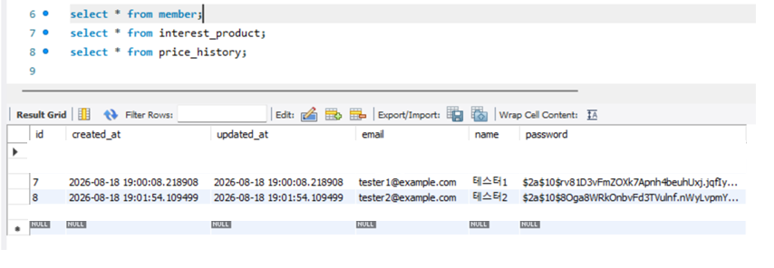
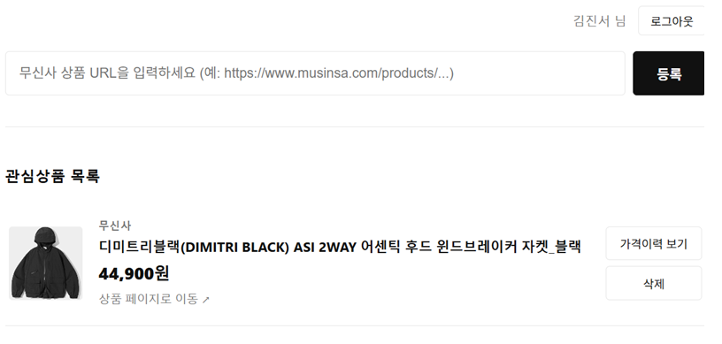
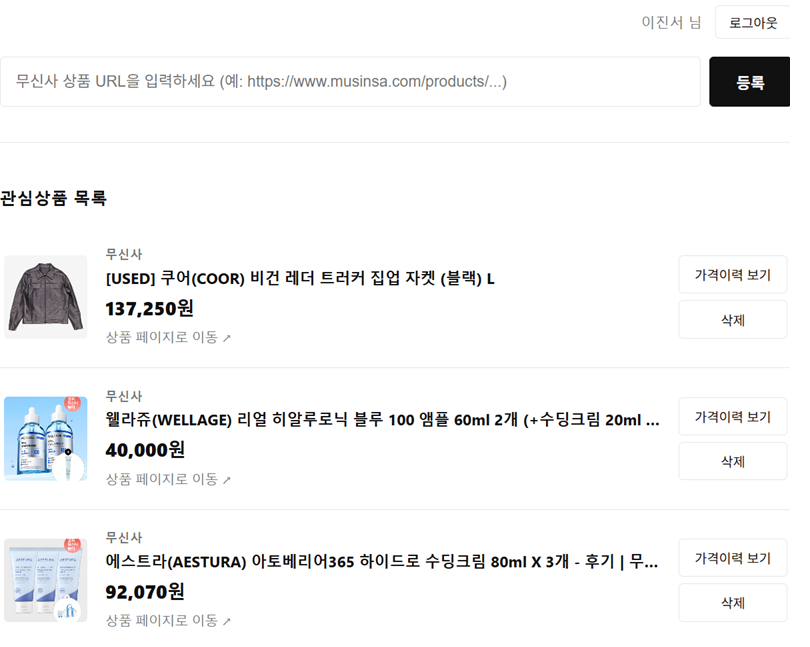
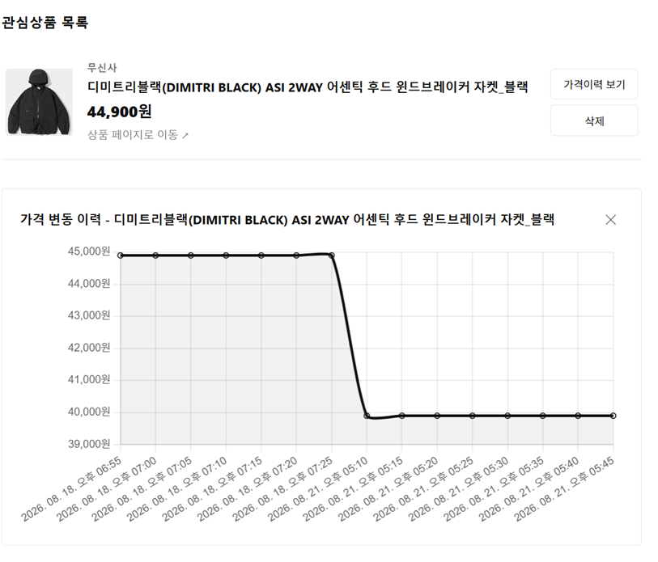

# 📦 Price Tracker

관심 있는 쇼핑몰 상품의 URL을 등록하면, 주기적으로 최저가를 추적해서 가격 변동 이력을 보여주는 서비스입니다.


### 비밀번호 암호화 저장 (BCrypt)
비밀번호는 단방향 해싱으로 저장되어, DB가 유출되어도 원본을 복원할 수 없습니다.


### 회원별 관심상품 격리
| 회원 A                                          | 회원 B                                          |
|-------------------------------------------------|-------------------------------------------------|
|  |  |

### 가격 변동 이력



## 📌 소개

쇼핑몰 여러 곳을 돌아다니며 가격을 비교하는 게 번거로워서 만든 개인 프로젝트입니다.
관심 있는 상품의 URL을 등록해두면, 서버가 주기적으로 최신 가격을 조회해서 가격 변동 이력을 쌓아줍니다.

## ✨ 주요 기능

- [x] 회원가입 / 로그인 (Spring Security + JWT)
- [x] 회원별 관심상품 관리 (본인 등록 상품만 조회/삭제 가능)
- [x] 상품 URL 입력을 통한 관심상품 등록 (무신사 지원, 웹 스크래핑 기반 상품 정보 자동 수집)
- [x] 관심상품 등록 / 조회 / 삭제
- [x] 가격 변동 이력 저장 및 조회
- [x] 주기적 최저가 자동 갱신 스케줄러
- [ ] 다른 쇼핑몰(11번가, G마켓 등) 지원 확장 (예정)
- [ ] 목표가격 도달 시 이메일 알림 (예정)

## ⚠️ 지원 대상

현재는 **무신사(musinsa.com) 상품 URL만 지원**합니다.

웹 스크래핑 방식은 특정 쇼핑몰의 HTML(메타 태그) 구조에 맞춰 파싱하는 방식이라,
다른 쇼핑몰(11번가, G마켓 등) URL을 입력하면 상품 정보를 찾지 못해 파싱에 실패하며,
`400 Bad Request` 응답(`ProductParseFailedException`)을 받습니다.

향후 URL 도메인에 따라 파싱 로직을 분기하는 방식으로 다른 쇼핑몰 지원을 확장할 계획입니다.

## 🛠 사용 기술

- Java 17
- Spring Boot
- Spring Data JPA
- Spring Security
- JWT (jjwt)
- MySQL
- Jsoup
- HTML/CSS/JavaScript (프론트엔드)
- Docker, AWS EC2 (배포)

## 참고사항
프론트엔드는 백엔드 API 동작 확인을 위한 최소한의 데모 화면으로,
Claude Code를 활용해 빠르게 구현했습니다.

## 📁 프로젝트 구조

```
com.github.wlstjlee.pricetracker
├── config          # 전역 설정 (JPA Auditing, Scheduler, Security 등)
├── controller       # API 엔드포인트
├── dto              # 요청/응답 DTO
├── entity           # JPA 엔티티
├── exception        # 커스텀 예외, 전역 예외 처리
├── repository       # JPA Repository
├── scheduler        # 최저가 자동 갱신 스케줄러
├── security         # JWT 토큰 발급/검증, 인증 필터
└── service          # 비즈니스 로직 (회원 관리, 관심상품 관리, 웹 스크래핑)
```

## 📡 API 명세

### 인증

| 기능 | Method | URL | 요청 | 응답 |
|---|---|---|---|---|
| 회원가입 | POST | `/api/auth/signup` | email, password, name | 회원 정보 |
| 로그인 | POST | `/api/auth/login` | email, password | JWT 토큰, 회원 정보 |

### 관심상품 (모두 로그인 필요 — `Authorization: Bearer {token}` 헤더 필수)

| 기능 | Method | URL | 요청 | 응답 |
|---|---|---|---|---|
| 관심상품 등록 | POST | `/api/interests` | 무신사 상품 URL | 스크래핑된 상품 정보 |
| 관심상품 목록 조회 | GET | `/api/interests` | 없음 | 본인이 등록한 관심상품 리스트 |
| 관심상품 삭제 | DELETE | `/api/interests/{id}` | 없음 | 없음 (204) |
| 가격 이력 조회 | GET | `/api/interests/{id}/histories` | 없음 | 가격 변동 이력 리스트 |

> 로그인하지 않고 호출 시 `401 Unauthorized`, 본인 소유가 아닌 관심상품에 접근 시 `403 Forbidden`을 반환합니다.

## 🗂 ERD

```
Member (1) ──────< (N) InterestProduct (1) ──────< (N) PriceHistory

member                              interest_product                    price_history
├── id                              ├── id                               ├── id
├── email                           ├── name                              ├── price
├── password                        ├── url                               ├── interest_product_id (FK)
├── name                            ├── image_url                         ├── created_at
├── created_at                      ├── mall_name                         └── updated_at 
└── updated_at                      ├── current_lowest_price                           
                                     ├── member_id (FK)
                                     ├── created_at
                                     └── updated_at
```

## 🚀 실행 방법

```bash
git clone https://github.com/wlstjlee/price-tracker.git
cd price-tracker
```

`src/main/resources/application.properties` 파일을 생성하고 아래 내용을 채워주세요.

```properties
spring.datasource.url=jdbc:mysql://localhost:3306/pricetracker
spring.datasource.username=본인계정
spring.datasource.password=본인비밀번호
spring.jpa.hibernate.ddl-auto=update

jwt.secret=32자_이상의_랜덤_문자열
jwt.expiration=3600000
```

```bash
./gradlew bootRun
```

## 🧪 테스트

Service(단위 테스트), Repository(`@DataJpaTest`), Controller(`@WebMvcTest`) 계층별로 테스트 코드를 작성했습니다.

```bash
./gradlew test
```

## ☁️ 배포

AWS EC2(Ubuntu, t2.micro)에 Docker로 MySQL을 띄우고, Spring Boot를 직접 배포했습니다.

```
[사용자] → http://퍼블릭IP:8080 → [EC2: Spring Boot(8080)] → localhost:3306 → [Docker: MySQL]
```

배포 과정에서 겪은 문제들은 아래 트러블슈팅 9~11번에 정리했습니다.

## 🐛 트러블슈팅

### 1. `created_at` / `updated_at`이 계속 NULL로 저장됨
- **원인**: `@EntityListeners`, `@CreatedDate`는 정상이었으나, `@EnableJpaAuditing`을 붙인 설정 클래스 자체를 만들지 않음
- **해결**: `config` 패키지에 `@EnableJpaAuditing`을 붙인 `JpaAuditingConfig` 추가

### 2. FK로 연결된 부모 테이블 데이터 삭제 시 에러
- **원인**: `PriceHistory`가 `InterestProduct`를 FK로 참조하고 있어, 부모를 먼저 삭제하면 데이터 정합성이 깨질 수 있어 DB가 차단
- **해결**: 애플리케이션 코드에서 자식(`PriceHistory`)을 먼저 삭제한 뒤 부모(`InterestProduct`)를 삭제하도록 `Service` 로직 수정

### 3. 네이버 쇼핑 검색 API 서비스 종료 (2026-07-31)
- **원인**: 네이버가 사전 공지 후 검색 API 중 쇼핑·책·전문자료 API를 유예기간 없이 전면 종료
- **대응 과정**:
    1. 쿠팡 파트너스 API 검토 → 블로그/웹사이트 등록 및 스크린샷 승인 절차 필요, 시간당 호출 10건 제한으로 개발 단계에서도 부담
    2. 11번가 오픈API 검토 → 셀러(사업자) 계정 및 고정 IP 등록 필요, 유동 IP를 쓰는 개인 개발 환경에 부적합
    3. 다나와 오픈API 검토 → 2019년에 이미 서비스 종료
    4. **최종적으로 Jsoup 기반 웹 스크래핑 방식으로 전환**
- **변경 내용**:
    - `NaverShoppingService`, `NaverSearchResponse`, `ProductSearchDTO`, `ProductSearchController` 삭제
    - `ProductParsingService`, `ProductParseResult` 신규 추가
    - 관심상품 등록 방식을 "검색 후 결과 선택"에서 "상품 URL 직접 입력"으로 변경
    - `InterestProduct`의 `naverProductId` 필드 제거 (저장된 URL로 재스크래핑하는 방식으로 대체)
- **배운 점**: 외부 API 의존 시 서비스 중단 리스크를 고려해야 하며, Controller/Service 계층을 분리해둔 덕분에 핵심 로직(외부 데이터 수집 방식)만 교체하고 Entity/Repository/Controller 등 나머지 구조는 그대로 재사용할 수 있었음

### 4. 쿠팡 웹 스크래핑 시 403 Forbidden 발생
- **원인**: 쿠팡이 Akamai 기반의 강력한 봇 탐지 시스템을 갖추고 있어, Jsoup의 단순 HTTP 요청은 봇으로 판별되어 차단됨
- **시도한 방법**: User-Agent, Referer, Accept-Language 등 HTTP 헤더를 실제 브라우저와 유사하게 강화 → 여전히 403으로 차단됨
- **원인 분석**: Jsoup은 HTML만 가져올 뿐 JavaScript 실행, 쿠키 교환 등 실제 브라우저의 동작을 재현하지 못해 대형 쇼핑몰의 봇 탐지에 쉽게 걸림
- **대응**: 스크래핑 대상을 쿠팡에서 무신사로 변경  

### 5. 무신사 상품 상세 페이지 파싱 성공 원인 분석
- **배경**: 무신사는 SPA 기반 사이트로 알려져 있어, Jsoup으로는 파싱이 불가능할 것으로 예상했으나 실제로는 성공함 
- **원인**: 무신사는 검색엔진 최적화(SEO) 를 위해 상품 상세페이지를 SSR(서버사이드 렌더링) 방식을 병행하고 있어, 서버가 최초 응답 시점에 이미 완성된 HTML을 내려줌
- **적용**: CSS 선택자 대신 사이트 리뉴얼에 영향을 덜 받는 og:titla, og:image, product:price:amount 등 Open Graph 태그를 파싱 대상으로 선택

### 6. JWT 로그인 API가 계속 401을 반환하던 문제
- **원인**: `passwordEncoder.matches(request.getPassword(), member.getEmail())`처럼, 비교 대상을 `getPassword()`가 아닌 `getEmail()`로 잘못 넣은 단순 오타
- **해결**: `member.getPassword()`(암호화된 비밀번호)와 비교하도록 수정
- **배운 점**: Getter 이름이 비슷한 필드가 많을 때(email, password 등) IDE 자동완성 과정에서 실수하기 쉬우며, 이런 버그는 로그를 찍어 실제 비교 대상을 확인하는 것이 빠른 원인 파악에 도움이 됨

### 7. 인증 실패 시 401이 아닌 403이 반환되던 문제
- **원인**: `SecurityConfig`에서 `formLogin`, `httpBasic`을 모두 비활성화하면서, Spring Security가 인증 실패 시 401을 응답하는 기본 진입점(AuthenticationEntryPoint)까지 함께 사라져, 기본값인 `Http403ForbiddenEntryPoint`가 적용됨
- **확인**: 로그인하지 않고 API 호출 시 403이 반환되어, 프론트엔드의 "401이면 로그인 화면으로 이동" 로직이 동작하지 않음
- **해결**: `SecurityConfig`에 커스텀 `AuthenticationEntryPoint`(`JwtAuthenticationEntryPoint`)를 등록하여, 인증 실패 시 명시적으로 401을 반환하도록 수정
- **배운 점**: 인증 실패(401)와 인가 실패(403)는 Spring Security 내부적으로 서로 다른 컴포넌트가 처리하며, 특정 인증 방식을 비활성화할 때 그에 딸려있던 기본 예외 처리까지 함께 사라질 수 있음을 확인

### 8. 회원별 관심상품 소유권 검증
- **구현**: `InterestProduct`에 `Member`와의 `@ManyToOne` 연관관계를 추가하고, 삭제/조회 시 요청자가 해당 상품의 실제 소유자인지 확인하는 `validateOwner()` 로직 추가
- **검증**: 다른 회원이 소유한 관심상품에 접근을 시도할 경우 `403 Forbidden`을 정상적으로 반환함을 확인
- **배운 점**: 인증(로그인 여부)과 별개로, 인가(해당 자원에 대한 권한)는 각 API 로직에서 명시적으로 검증해야 하며, 이 둘을 혼동하면 로그인만 하면 다른 사용자의 데이터에도 접근 가능한 보안 취약점이 발생할 수 있음

### 9. Gradle 빌드 중 Daemon이 강제 종료됨 (메모리 부족)
- **원인**: 프리티어 EC2(t2.micro/t3.micro)는 메모리가 1GB뿐인데, Gradle 빌드가 순간적으로 이를 초과해 리눅스가 프로세스를 강제 종료함
- **해결**: 스왑(Swap) 메모리를 추가해 물리 메모리 부족분을 디스크로 보충
  ```bash
  sudo fallocate -l 1G /swapfile
  sudo chmod 600 /swapfile
  sudo mkswap /swapfile
  sudo swapon /swapfile
  ```
- **배운 점**: 로컬 개발 환경과 배포 서버의 사양 차이로 인해, 로컬에서는 문제없던 빌드가 서버에서는 실패할 수 있음

### 10. 디스크 공간 부족으로 빌드 캐시 저장 실패
- **원인**: 기본 스토리지(8GB)가 OS, Docker, 빌드 캐시로 인해 91%까지 사용되어 `Could not write cache value` 에러 발생
- **해결**: AWS 콘솔에서 EBS 볼륨을 20GB로 확장한 뒤, 서버 내부에서 파티션과 파일시스템을 실제로 확장
  ```bash
  sudo growpart /dev/nvme0n1 1
  sudo resize2fs /dev/nvme0n1p1
  ```
- **배운 점**: 클라우드 콘솔에서 볼륨 크기를 늘리는 것과, 서버 내부의 파일시스템이 그 공간을 인식하는 것은 별개의 단계임

### 11. `docker system prune -a` 실행 중 MySQL 컨테이너가 함께 삭제됨
- **원인**: 디스크 공간 확보를 위해 실행한 `docker system prune -a -f` 명령어가, 당시 중지 상태였던 MySQL 컨테이너까지 함께 삭제함
- **확인**: 이후 애플리케이션 실행 시 `Unable to determine Dialect` 에러가 발생, 로그를 근본 원인까지 추적한 결과 DB 연결 자체가 불가능한 상태였음을 확인
- **해결**: MySQL 컨테이너를 동일한 설정으로 재생성
- **배운 점**: `docker system prune`의 `-a` 옵션은 실행 중이 아닌 컨테이너/이미지까지 모두 삭제하므로 신중하게 사용해야 하며, 여러 에러가 연쇄적으로 발생할 때는 가장 근본적인 원인(root cause)부터 확인해야 함

## 💭 배운 점

- JPA 연관관계(`@ManyToOne`, `mappedBy`, 연관관계의 주인)와 FK 제약이 실제 데이터 삭제에 미치는 영향
- Entity와 DTO의 책임 분리, 계층 간 의존 방향 원칙 (Entity는 DTO를 몰라야 함)
- 영속성 컨텍스트와 dirty checking을 이용한 안전한 데이터 수정
- 외부 API에 의존하는 서비스 설계 시 고려해야 할 리스크와, 계층 분리를 통한 변경 비용 최소화
- SSR/CSR 렌더링 방식의 차이와, 이것이 웹 스크래핑 가능 여부에 미치는 영향
- 인증(Authentication)과 인가(Authorization)의 차이, 그리고 각각을 처리하는 계층(필터 vs 서비스 로직)의 구분
- JWT의 구조(Header/Payload/Signature)와, 서명 기반 위변조 방지 원리 (암호화가 아닌 서명이라는 점)
- BCrypt를 이용한 단방향 해싱과, HTTPS(전송 구간 보호)의 역할 차이
- Spring Security의 필터 체인 구조와, 커스텀 필터를 등록해 인증 로직을 확장하는 방법
- Mockito, `@DataJpaTest`, `@WebMvcTest`를 활용한 계층별 테스트 전략의 차이(단위 테스트 vs 슬라이스 테스트)
- AWS EC2를 이용한 실제 배포 과정과, 로컬 개발 환경과 서버 환경(메모리, 디스크 사양)의 차이에서 오는 문제들
- Docker 명령어(`system prune` 등)의 옵션이 미치는 영향과, 인프라 작업 시 신중함의 중요성
- 여러 에러가 연쇄적으로 발생할 때, 로그를 근본 원인(root cause)까지 추적하는 습관
- Git을 이용한 변경 이력 관리와, 트러블슈팅을 기록하는 습관의 중요성
